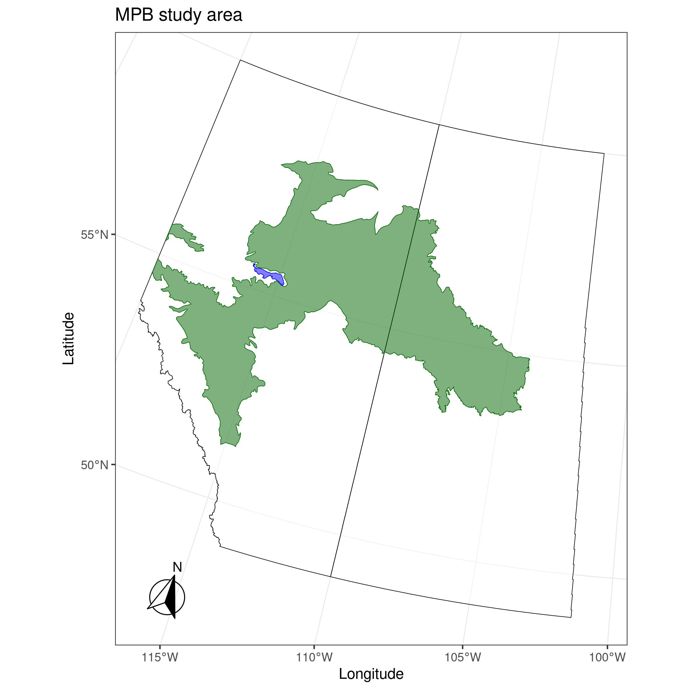

## MPB_boreal

### Mountain Pine Beetle Red Top Model

Evaluate short-run potential for MPB establishment, eruption, and spread in Canadian boreal forests.

**Authors:**

- Alex M. Chubaty (<achubaty@for-cast.ca>)
- Barry Cooke (<barry.cooke@canada.ca>)
- Eliot McIntire (<eliot.mcintire@canada.ca>)

**Date:** June 30, 2021

### Default Study Area



### Modules

- [MPB_boreal_studyArea](https://github.com/achubaty/MPB_boreal_studyArea)
- [mpbClimateData](https://github.com/achubaty/mpbClimateData)
- [mpbMassAttacksData](https://github.com/achubaty/mpbMassAttacksData)
- [mpbPine](https://github.com/achubaty/mpbPine)
- [mpbRedTopSpread](https://github.com/achubaty/mpbRedTopSpread)

Future linkages include the `LandR` Biomass suite of modules to simulate/forecast forest vegetation dynamics, and the `fireSense` wildfire simulation model.

### Getting the code

All modules are written in R and all model code was developed collaboratively using GitHub (<https://github.com>), with each module contained in it's own (currently private) git repository (see below).
Code that is shared among modules was bundled into R packages, and hosted in open git repositories.
All package code is automatically and regularly tested using cross-platform continuous integration frameworks to ensure the code is reliable and free of errors.

```bash
## master branch
git clone --recurse-submodules -j8 https://github.com/achubaty/MPB_boreal

## development branch
git clone --single-branch -b development --recurse-submodules -j8 https://github.com/achubaty/MPB_boreal
```

### Prerequisites

- R version 4.0 or higher
- GDAL, PROJ, GEOS system libraries

The code is mostly self-sufficient: additional packages than those below are needed, but will be installed automatically.
See `03-packages.R` to see which additional packages will be used.
